# DevPulse - AI-Powered GitHub Activity Dashboard

DevPulse brings a team's GitHub activity (repositories, commits, pull requests, contributors) into one interactive dashboard and uses an AI model (Gemini or OpenAI) to write sprint summaries, productivity insights and suggestions.

| Layer | Technology |
|---|---|
| Frontend | React, Tailwind CSS, Recharts (Vite) |
| Backend | Node.js, Express |
| Database | PostgreSQL |
| Auth | GitHub OAuth (session in an httpOnly JWT cookie) |
| AI | Google Gemini or OpenAI API (rule-based fallback when no key is set) |
| DevOps | Docker, GitHub Actions, Railway |

## Try it without any setup: the live demo

Click **Explore the live demo** on the login page. It signs you into a shared demo workspace (`acme/*` repositories) whose
activity is generated on the fly and flows through the **real** pipeline (sync -> PostgreSQL -> analytics -> AI report). It never
calls GitHub or a paid AI API. The demo repositories deliberately include edge cases: a very long repo name, an empty repo, a
single-commit repo, a dormant repo and a monorepo that hits GitHub's pagination cap. Disable it with `DEMO_ENABLED=false`.

## Landing page

The signed-out home page is a full marketing page: a hero with floating product cards that drift on their own and follow the
pointer, a scroll-through product tour built from real screenshots, live interactive sample charts, an AI summary that writes
itself in, a tech marquee, a how-it-works timeline, privacy notes and an FAQ.

| Hero | Product tour | AI summary |
|---|---|---|
| 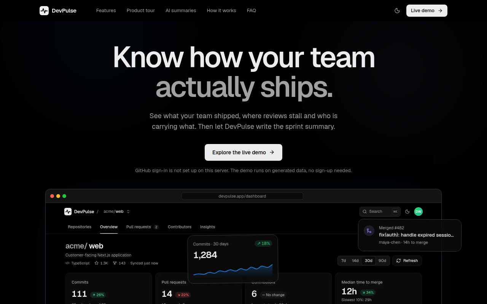 | 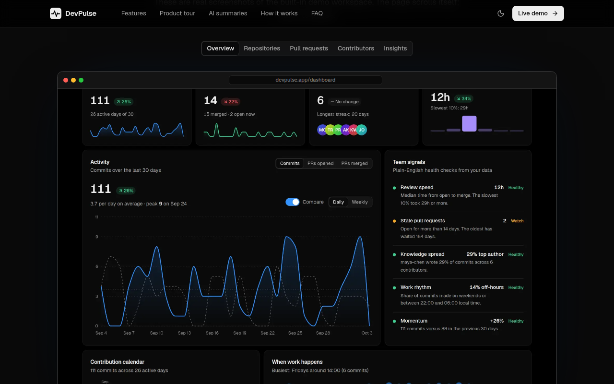 | 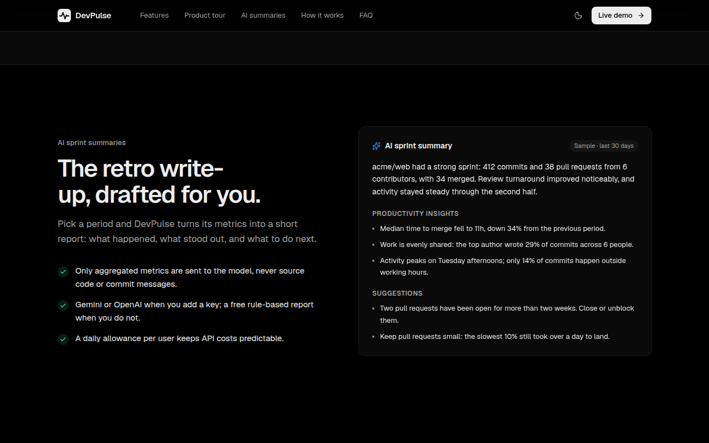 |

Typography and motion follow the same rules as the app, tuned for a page people see once: a two-tone solid headline with
tight tracking and balanced line breaks (no gradient text), one calm ease-out entrance per line, scroll reveals that play once,
idle motion that is transform-only, and a fully gentler `prefers-reduced-motion` path (covered by Playwright). Product
imagery comes from the real app: `cd frontend && npm run landing:assets` re-captures it from the demo workspace.

## Screenshots

| Overview (dark) | Repositories |
|---|---|
| 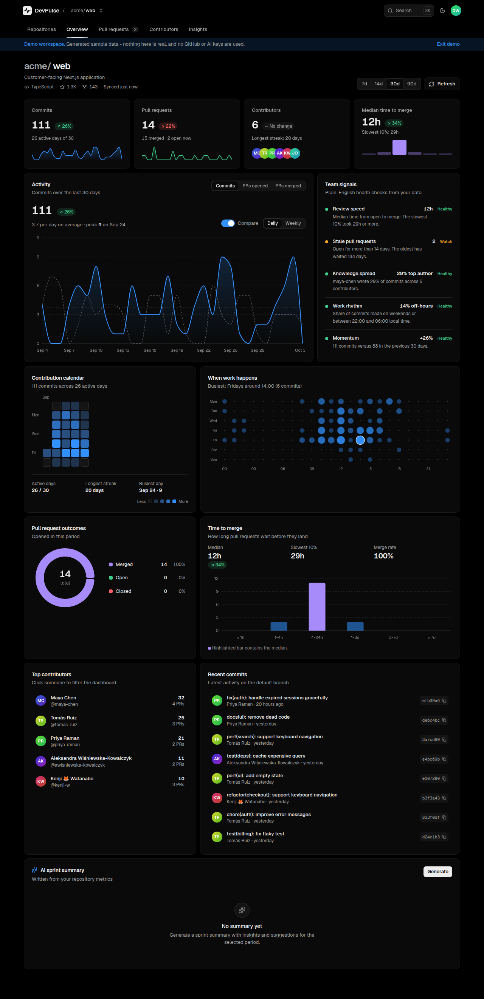 | 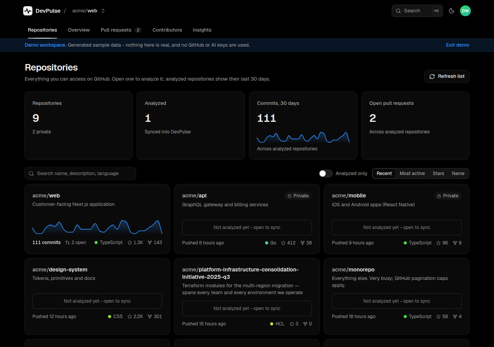 |

| Pull requests | Contributors |
|---|---|
| 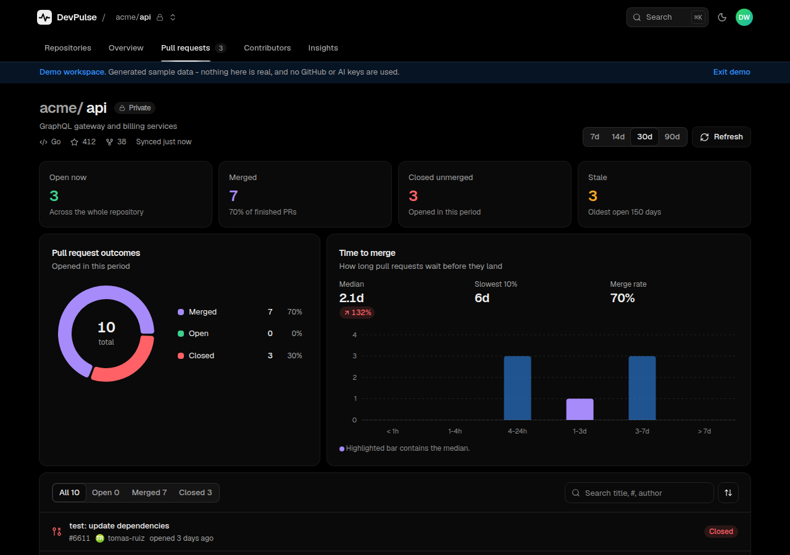 | 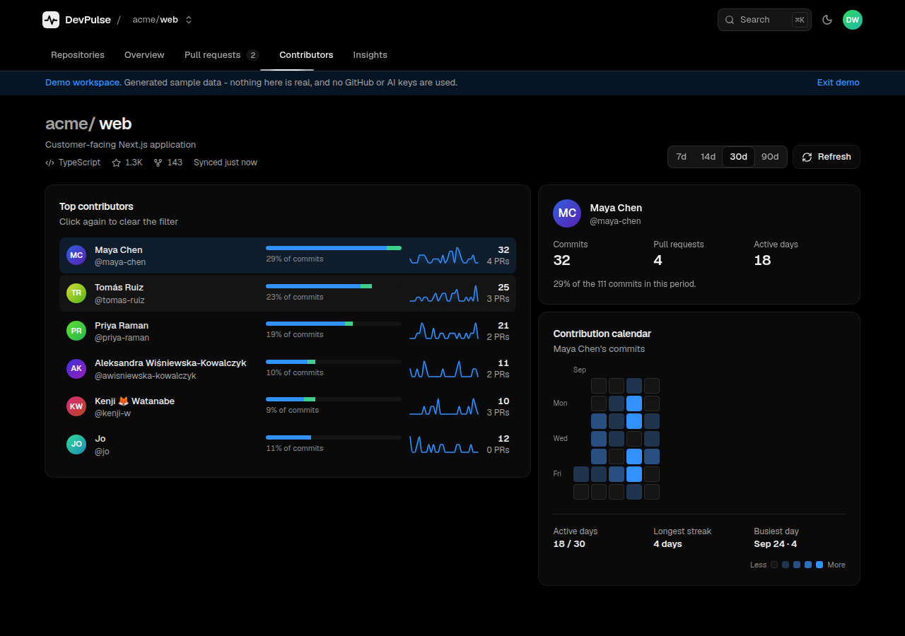 |

| Insights | Light theme | Command menu | Mobile |
|---|---|---|---|
| 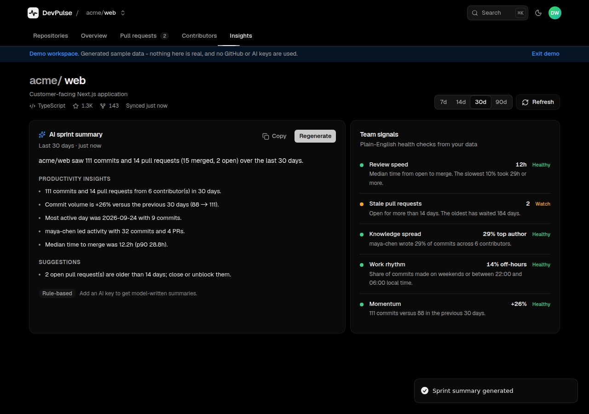 | 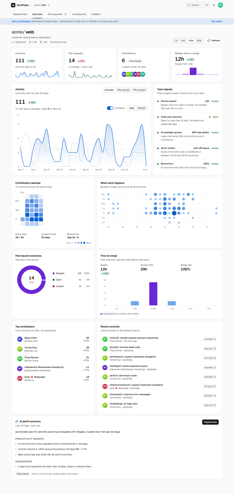 | 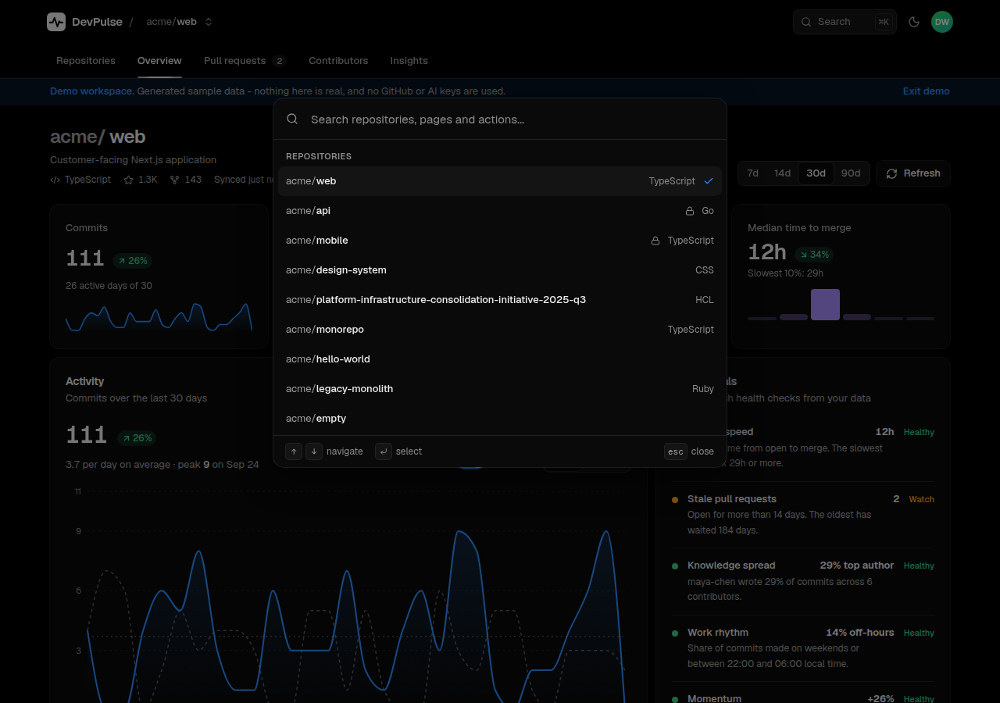 | 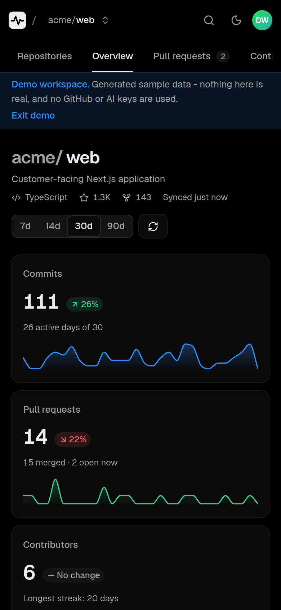 |

Regenerate them from the real app with `cd frontend && npm run screenshots`. Design, data flow and trade-offs are in
[docs/ARCHITECTURE.md](docs/ARCHITECTURE.md).

## The dashboard

- **Repositories** - every repository you can access, with search, sorting, and a 30-day activity sparkline plus open-PR
  count for the ones DevPulse has analyzed; totals across all of them at the top.

- **Overview** - KPI cards with sparklines and period-over-period deltas, an interactive activity chart (commits / PRs opened /
  PRs merged, daily or weekly, previous-period overlay, per-day top contributors in the tooltip), contribution calendar, a
  weekday x hour "when work happens" chart in *your* time zone, PR outcomes, time-to-merge histogram, contributors, recent
  commits and the AI summary.
- **Pull requests** - searchable, filterable list with stale-PR detection and lead times.
- **Contributors** - per-person activity; click anyone to filter the whole dashboard (the filter lives in the URL).
- **Insights** - plain-English health signals (review speed, stale PRs, knowledge spread, work rhythm, momentum) and AI report history.
- **Account control** - *Delete account & data* (type your username to confirm) removes everything stored and revokes the GitHub grant.
- `Cmd/Ctrl+K` command menu (repositories, pages, time range, actions), light/dark/system theme, shareable URLs
  (`?repo=owner/name&range=30&who=login`), skeleton/empty/error states for every view, responsive down to 320px.

Motion follows Emil Kowalski's design-engineering rules (https://github.com/emilkowalski/skills): custom ease-out curves, only
`transform`/`opacity`, press feedback on every control, origin-aware popovers, no animation on keyboard-initiated actions
(the command menu), entrance animations only on the first paint of a session, blur-masked content swaps, and full
`prefers-reduced-motion` support. Libraries: Base UI (menus, tooltips, tabs, dialog), cmdk, Sonner, NumberFlow, Recharts.

## How it works

1. The user logs in with **GitHub OAuth**; the GitHub access token is stored **AES-256-GCM encrypted**.
2. The user picks a repository. The backend fetches repository metadata, commits and pull requests from the **GitHub API** (using the user's own token, so private-repo access is enforced by GitHub).
3. Data is upserted into **PostgreSQL** (per-user, so data never leaks between accounts) and aggregated into analytics.
4. On request, the aggregated metrics are sent to the **AI provider**, and the resulting report is stored in `ai_reports`.
5. The React dashboard renders charts, contributor stats, PRs and the latest AI report.

### REST API

| Method & path | Description |
|---|---|
| `GET /api/auth/github` | Start GitHub OAuth |
| `GET /api/auth/github/callback` | OAuth callback, sets session cookie |
| `POST /api/auth/logout` | Clear the session |
| `GET /api/user` | Current user |
| `GET /api/repositories` | Repositories the user can access |
| `GET /api/repositories/:owner/:repo/commits?days=` | Recent commits |
| `GET /api/repositories/:owner/:repo/pulls?days=` | Recent pull requests |
| `GET /api/analytics/summary?repo=owner/name&days=&tzOffset=` | Totals, daily series, previous-period comparison, punchcard, lead-time histogram, contributors |
| `POST /api/ai/sprint-summary` `{repo, days}` | Generate and store an AI report |
| `GET /api/ai/reports?repo=owner/name` | Previous AI reports |
| `POST /api/auth/demo` | Start the demo workspace |
| `GET /api/config` | What this deployment supports (GitHub login, demo, AI) |
| `GET /api/health` | Health check (includes a database ping) |

Add `refresh=true` to the data endpoints to bypass the 2-minute sync cache.

## Project structure

```
backend/    Express API (config, routes, controllers, services, middleware, tests)
frontend/   React + Tailwind + Recharts dashboard (Vite)
database/   versioned SQL migrations (applied automatically, under an advisory lock, on server start)
docs/       ARCHITECTURE.md (diagrams, decisions, limits) and screenshots/
.github/    CI/CD workflow
Dockerfile, docker-compose.yml, railway.json
```

## Running locally

### 1. Create a GitHub OAuth app
GitHub -> Settings -> Developer settings -> OAuth Apps -> New. Set the callback URL to `http://localhost:4000/api/auth/github/callback` (Docker) or the same URL for the dev setup below.

### 2. Configure
```bash
cp .env.example .env     # fill in GITHUB_CLIENT_ID/SECRET, JWT_SECRET, TOKEN_ENCRYPTION_KEY (openssl rand -hex 32)
```
`GEMINI_API_KEY` / `OPENAI_API_KEY` are optional; without one DevPulse produces a rule-based summary.

### 3a. With Docker (app + PostgreSQL)
```bash
docker compose up --build        # http://localhost:4000
```

### 3b. Without Docker
Needs Node 20+ and a PostgreSQL database matching `DATABASE_URL`.
```bash
cd backend  && npm install && npm run dev     # API on :4000
cd frontend && npm install && npm run dev     # UI on :5173 (proxies /api to :4000)
```
For this setup keep `FRONTEND_URL=http://localhost:5173` in `.env`.

## Tests and quality gates
```bash
cd backend  && npm run lint && TEST_DATABASE_URL=postgresql://... npm test   # unit, API and PostgreSQL integration (incl. concurrent migrations)
cd frontend && npm run lint && npm test                                       # component and unit tests
cd frontend && E2E_DATABASE_URL=postgresql://... npm run e2e                  # Playwright against the real stack in demo mode,
                                                                              # incl. axe accessibility scans (WCAG 2.1 AA, both themes)
```
The e2e suite needs a Chromium (`npx playwright install chromium`, or set `PLAYWRIGHT_CHROMIUM_PATH`).

## CI/CD and deployment (Railway)

`.github/workflows/ci.yml` runs on every push/PR:

1. **Test & build** - lint, backend tests against a PostgreSQL service container, frontend tests and build.
2. **End-to-end & accessibility** - Playwright drives the built app against PostgreSQL in demo mode.
3. **Docker** - builds the image; on `main` pushes it to GitHub Container Registry (`ghcr.io/<owner>/<repo>`).
4. **Deploy** - on `main`, deploys to Railway with `railway up`.

Railway setup:
1. Create a Railway project with a **PostgreSQL** plugin and an empty service named `devpulse` (or set the `RAILWAY_SERVICE` repo variable).
2. On the service set variables: `NODE_ENV=production`, `DATABASE_URL` (reference the Postgres plugin), `DATABASE_SSL=false` (internal network), `BASE_URL` and `FRONTEND_URL` (both = the service's public URL), `GITHUB_CLIENT_ID`, `GITHUB_CLIENT_SECRET`, `JWT_SECRET`, `TOKEN_ENCRYPTION_KEY`, and optionally `AI_PROVIDER` + the API key.
3. Update the GitHub OAuth app's callback URL to `https://<your-domain>/api/auth/github/callback`.
4. Add a Railway **project token** as the `RAILWAY_TOKEN` secret in GitHub (Settings -> Secrets and variables -> Actions).

The production server refuses to start if the required secrets are missing.

## Known limits

- GitHub's API is paginated: DevPulse reads at most the 1,000 most recent commits and 500 most recently updated PRs per repository. When that cuts
  into the selected range the dashboard says so and withholds period-over-period comparisons rather than showing a misleading delta.
- Paid AI summaries are capped per user per day (`AI_DAILY_LIMIT`, default 20); rule-based ones are free.
- Days and hours are bucketed in the viewer's time zone (sent as `tzOffset`), not UTC.
- The `repo` OAuth scope is needed to read private repositories. Set `GITHUB_SCOPE="read:user user:email public_repo"` to limit DevPulse to public ones.

## Security notes
HTTPS via Railway, GitHub OAuth with `state` check, httpOnly + SameSite cookies, session JWTs pinned to HS256 + issuer, encrypted tokens at rest, Helmet headers and a strict CSP (no inline scripts), per-IP rate limiting, strict input validation on repository names, hard timeouts on every outbound call, request ids on every response and log line (query strings are never logged), account deletion with GitHub grant revocation, secrets only through environment variables, and a non-root container user.
