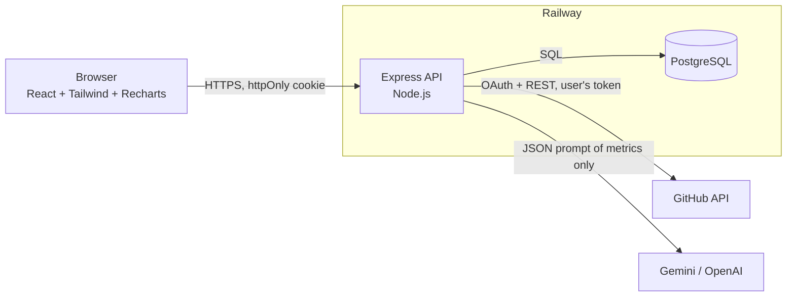
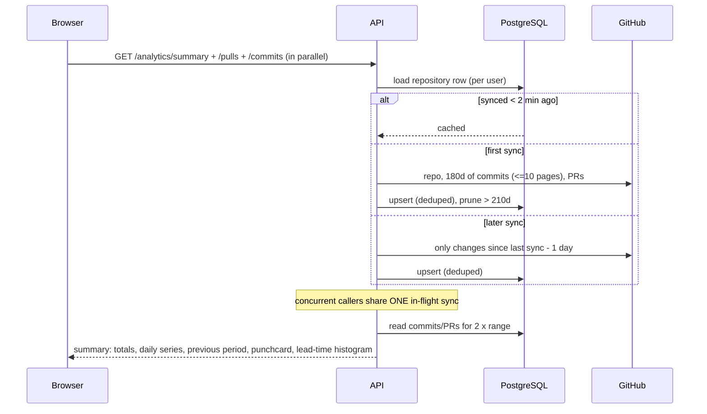

# DevPulse architecture

## System context



In production a single container serves both the API (`/api/*`) and the built React app, so cookies are same-origin and
there is no CORS surface. The image is built by GitHub Actions, pushed to GHCR and deployed to Railway.

## Request flow for one dashboard view



## Data model

```mermaid
erDiagram
  users ||--o{ repositories : owns
  repositories ||--o{ commits : has
  repositories ||--o{ pull_requests : has
  repositories ||--o{ ai_reports : has
  users ||--o{ ai_reports : requested
  users { int id PK; bigint github_id UK; text login; text access_token_enc; bool is_demo; timestamptz repos_synced_at }
  repositories { int id PK; int user_id FK; text full_name; bool sync_truncated; timestamptz history_from; timestamptz last_synced_at }
  commits { int id PK; int repository_id FK; text sha; text author_login; text author_name; timestamptz committed_at }
  pull_requests { int id PK; int repository_id FK; int number; text state; timestamptz created_at; timestamptz merged_at }
  ai_reports { int id PK; int repository_id FK; int user_id FK; text provider; jsonb content; jsonb metrics }
```

Repositories are stored **per user**, so private-repository data can never be served to someone GitHub would not have
shown it to. Deleting a user cascades through everything above.

## Decisions worth knowing

| Decision | Why |
|---|---|
| Analytics are computed in a **pure function** (`analyticsService.buildSummary`) over rows | Trivially unit-testable; no SQL date math to get wrong across time zones |
| Days and hours are bucketed in the **viewer's time zone** (`tzOffset`) | A commit at 23:30 local belongs to the day the author remembers |
| Previous-period deltas are **withheld** when GitHub pagination truncated history inside that period | Showing "+315%" computed from half a period is worse than showing nothing |
| One **in-flight sync per repository** | The dashboard fires three requests at once; they must not each hit GitHub |
| **Incremental sync** with one day of overlap; a truncated delta falls back to a full resync | Keeps "Refresh" to a couple of API calls without ever leaving a gap |
| Tokens are **AES-256-GCM encrypted**; JWT is pinned to HS256 + issuer | Stored credentials are the highest-value data we hold |
| **Versioned SQL migrations** behind a Postgres advisory lock | Two replicas starting together cannot race or half-apply a schema |
| The **demo workspace** implements the same interface as the GitHub client | The demo exercises the real sync -> database -> analytics path, and can never spend a real API key |
| Paid AI calls have a **per-user daily quota**; rule-based reports are free | An authenticated user must not be able to burn the deployment's API credits |
| Outbound calls have **hard timeouts**; the pool handles idle-client errors | A stalled upstream or a database restart must not hang requests or crash the process |

## Quality gates

| Layer | Tooling | Runs in CI |
|---|---|---|
| Backend unit + API + PostgreSQL integration | `node --test` (incl. concurrent-migration and incremental-sync tests) | yes |
| Frontend units and components | Vitest + Testing Library | yes |
| End-to-end + accessibility (WCAG 2.1 AA, both themes, every page) | Playwright + axe-core against the real stack in demo mode | yes |
| Lint | ESLint (backend, frontend incl. React hooks/compiler rules) | yes |
| Dependencies | Dependabot (npm, Docker, Actions) | weekly |

## Known limits

- GitHub's REST pagination bounds history to the 1,000 most recent commits and 500 most recently updated PRs per
  repository; the UI says so when it affects the selected range.
- Review-level data (time to first review, PR size) needs one extra API call per PR and is deliberately not collected.
- Rate limiting and the in-flight sync map are per process; running several replicas would want a shared store (Redis).
